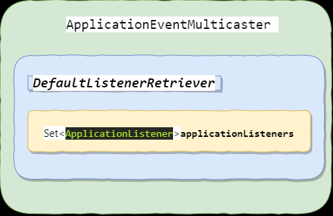

## Content:


`ApplicationEventMulticaster `




该类的作用就是

	* **添加监听器**
	* **对所有监听器或者指定监听器发送事件进行处理**

```java
public interface ApplicationEventMulticaster {
	/**
	 * Add a listener to be notified of all events.
	 * @param listener the listener to add
	 * @see #removeApplicationListener(ApplicationListener)
	 * @see #removeApplicationListeners(Predicate)
	 */
	void addApplicationListener(ApplicationListener<?> listener);

	/**
	 * Add a listener bean to be notified of all events.
	 * @param listenerBeanName the name of the listener bean to add
	 * @see #removeApplicationListenerBean(String)
	 * @see #removeApplicationListenerBeans(Predicate)
	 */
	void addApplicationListenerBean(String listenerBeanName);

	/**
	 * Remove a listener from the notification list.
	 * @param listener the listener to remove
	 * @see #addApplicationListener(ApplicationListener)
	 * @see #removeApplicationListeners(Predicate)
	 */
	void removeApplicationListener(ApplicationListener<?> listener);

	/**
	 * Remove a listener bean from the notification list.
	 * @param listenerBeanName the name of the listener bean to remove
	 * @see #addApplicationListenerBean(String)
	 * @see #removeApplicationListenerBeans(Predicate)
	 */
	void removeApplicationListenerBean(String listenerBeanName);

	/**
	 * Remove all matching listeners from the set of registered
	 * {@code ApplicationListener} instances (which includes adapter classes
	 * such as {@link ApplicationListenerMethodAdapter}, e.g. for annotated
	 * {@link EventListener} methods).
	 * <p>Note: This just applies to instance registrations, not to listeners
	 * registered by bean name.
	 * @param predicate the predicate to identify listener instances to remove,
	 * e.g. checking {@link SmartApplicationListener#getListenerId()}
	 * @since 5.3.5
	 * @see #addApplicationListener(ApplicationListener)
	 * @see #removeApplicationListener(ApplicationListener)
	 */
	void removeApplicationListeners(Predicate<ApplicationListener<?>> predicate);

	/**
	 * Remove all matching listener beans from the set of registered
	 * listener bean names (referring to bean classes which in turn
	 * implement the {@link ApplicationListener} interface directly).
	 * <p>Note: This just applies to bean name registrations, not to
	 * programmatically registered {@code ApplicationListener} instances.
	 * @param predicate the predicate to identify listener bean names to remove
	 * @since 5.3.5
	 * @see #addApplicationListenerBean(String)
	 * @see #removeApplicationListenerBean(String)
	 */
	void removeApplicationListenerBeans(Predicate<String> predicate);

	/**
	 * Remove all listeners registered with this multicaster.
	 * <p>After a remove call, the multicaster will perform no action
	 * on event notification until new listeners are registered.
	 * @see #removeApplicationListeners(Predicate)
	 */
	void removeAllListeners();

	/**
	 * Multicast the given application event to appropriate listeners.
	 * <p>Consider using {@link #multicastEvent(ApplicationEvent, ResolvableType)}
	 * if possible as it provides better support for generics-based events.
	 * @param event the event to multicast
	 */
	void multicastEvent(ApplicationEvent event);

	/**
	 * Multicast the given application event to appropriate listeners.
	 * <p>If the {@code eventType} is {@code null}, a default type is built
	 * based on the {@code event} instance.
	 * @param event the event to multicast
	 * @param eventType the type of event (can be {@code null})
	 * @since 4.2
	 */
	void multicastEvent(ApplicationEvent event, @Nullable ResolvableType eventType);

}

```

###  添加监听器 

listener 保存在linkedhashmap中 在multicaster

```java
void addApplicationListener(ApplicationListener<?> listener); 
```

### 广播事件

`SimpleApplicationEventMultiaster`

```java
	@Override
	public void multicastEvent(final ApplicationEvent event, @Nullable ResolvableType eventType) {
		ResolvableType type = (eventType != null ? eventType : resolveDefaultEventType(event));
		Executor executor = getTaskExecutor(); // 返回所有 处理event 事件 的 listener
		for (ApplicationListener<?> listener : getApplicationListeners(event, type)) {
			if (executor != null) {
				executor.execute(() -> invokeListener(listener, event));
			}
			else {
				invokeListener(listener, event);
			}
		}
	}
// 调用listener 去执行 业务代码
	protected void invokeListener(ApplicationListener<?> listener, ApplicationEvent event) {
		ErrorHandler errorHandler = getErrorHandler();
		if (errorHandler != null) {
			try {
				doInvokeListener(listener, event);
			}
			catch (Throwable err) {
				errorHandler.handleError(err);
			}
		}
		else {
			doInvokeListener(listener, event);
		}
	}

	private void doInvokeListener(ApplicationListener listener, ApplicationEvent event) {
		try {
			listener.onApplicationEvent(event);
		}
		catch (ClassCastException ex) {
			String msg = ex.getMessage();
			if (msg == null || matchesClassCastMessage(msg, event.getClass()) ||
					(event instanceof PayloadApplicationEvent &&
							matchesClassCastMessage(msg, ((PayloadApplicationEvent) event).getPayload().getClass()))) {
				// Possibly a lambda-defined listener which we could not resolve the generic event type for
				// -> let's suppress the exception.
				Log loggerToUse = this.lazyLogger;
				if (loggerToUse == null) {
					loggerToUse = LogFactory.getLog(getClass());
					this.lazyLogger = loggerToUse;
				}
				if (loggerToUse.isTraceEnabled()) {
					loggerToUse.trace("Non-matching event type for listener: " + listener, ex);
				}
			}
			else {
				throw ex;
			}
		}
	}
```

### 事件发布

```
//1. 事件发布器 发布事件
publisher.publishEvent(new new RefreshRoutesEvent(NacosRouteDefinitionRegistry.this) );
//2. 事件广播器 广播事件 AbstractApplicationContext
	getApplicationEventMulticaster().multicastEvent(applicationEvent, eventType);
//3.1 根据event 找到对应的listener
	AbstractApplicationEventMulticaster.getApplicationListeners(event, type)
//3.2  遍历listener 处理事件
SimpleApplicationEventMulticaster.invokeListeners()
```

## 参考文章

* https://www.cnblogs.com/rickiyang/p/12001524.html#3466545070