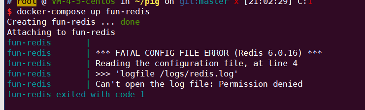
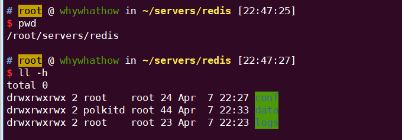

### 2022.02.16 spring.profile 不生效

- 在构建项目的过程中,出现 classpath问题, 大致原因:
  - 项目问题--> rebuild项目
  - maven resources 资源配置问题(导致resources文件夹下的配置文件被排除在外了), 重新修改一下.

- **在实现多环境配置开发中, 发现由于springboot 版本不同导致application.yml 不能成功应用其他application-dev.yml**
  - **解决方案: spring.config.use-legacy-processing=true**
  - 官方链接

### 2022.03.22 Mybatis 查询结果与mysql查询结果不一致

* MySQL查询结果与Mybatis 查询结果不一致:

  Reason:

  ​ Druid select 查询语句 **结果集返回行数限制,**

  ​	 **stupid ! ! !**

### 2022.04.05 服务器中毒

G了, 服务器被中木马了,被挖矿了,呜呜呜, 费劲!

* **show:**
  redis用于存储用户身份令牌, 用户身份令牌频繁失效(未到过期时间),想到可能是rdb文件写入没有权限,就小手一点,放开权限, 带来悲剧,ε(┬┬﹏┬┬)3
  * 最初部署在docker 中, 令牌重复刷新 (hint ,这个时候我也已经看到redis 包


* **Reason:**

  rdb文件写入系统, 执行 cron定时任务.

  * redis 具有root权限, 可读可写
  * redis-cli 可以设置 rdb 文件路径
  * redis-cli 通过set 命令 获取脚本, rdb保存后,定时任务自动执行.	  

> 大部分redis服务都是在root权限下的，所以其实redis是有全局的读写权限的。
> 而且redis本身在客户端就可以通过`CONFIG GET/SET`指令获取或修改配置，在没有密码保护的情况下，这个是很危险的。
> 通常黑客在发现redis服务可以访问（无密码或弱密码）后，首先会通过这样的手段修改redis的rdb文件路径和名字：
>
>```
>config set dir /var/spool/cron
>config set dbfilename root
>```
>
>没错，将rdb文件修改为root用户的定时任务文件。
> 然后写入几个key，并保存。
>
>```
>set xxoo "\n\n*/1 * * * * somecommand"
>save
>```
>
>这样一个指令somecommand就以rdb的形式保存到了定时任务中。
> 这个somecommand可以是一个反弹shell的命令（定时一定时间后，让这台肉鸡主动连接到自己机器上，反弹出shell让自己可以操作肉鸡）；而更为普遍的是自动下载一个脚本并自动运行，也就是我所遭遇的这个。

PS: 没想到redis还有这种漏洞, 可以用来挖矿....orz....

* **learn**: 

​	redis 安全考虑: 
​    **容器化, docker部署, 设置密码, 设置密码, 设置密码, 更换端口!更换端口!**

* **solution:** 

  之前有准备镜像盘, 准备重装系统从镜像盘回复.

  1. 系统命令被修改的一塌糊涂
  2. 个别指令被设置成 挖矿启动器 So Fun!

#### **ref:**

> * [参考链接1](https://www.wudi.space/2021/01/13/ExperienceOfMinerVirus/)
>  * [参考连接2](https://www.cnblogs.com/xiazhenbin/p/14779569.html)

### 2022.04.07 Redis docker-compose 配置问题

* 情景

​	log 日志无法写入-> permission denied  


* **Reason:** 

  redis配置文件所在的目录 缺少写权限, 无法将log 写入到日志文件

  ​	(实际上没有必要,写入后,无法通过docker logs -f fun-redis 查询日志信息)

* 解决方案 (1,2 必做)

  1. ```yaml
     ### yaml 添加   privileged: true
     version: '3.0'
     services:
       fun-redis:
         image: redis:6.2.6-alpine
     #    build: redis
         container_name: fun-redis
         ports:
           - "16379:6379"
         user: root
         privileged: true
         command:
           - redis-server /etc/conf/redis.conf
         volumes:
           - ./redis/conf:/etc/conf
           - ./redis/data:/data
           - ./redis/logs:/logs # 可以去掉,添加后,无法 通过docker logs -f 查询日志信息
     ```

  2. 为redis 文件目录添加写权限 

     ```shell
     # 暴力写法 ,临时使用
     cd redis # 进入redis 配置文件目录中
     chmod +777 *
     ```
  

* Ref:

  * https://www.cxybb.com/article/u013323965/89445757

### 2022.04.09  如何对mysql 进行批量插入性能优化.

项目在做批量插入的时候, **影响性能的因素 -> 创建的中间对象, 即 List<DataInfo> list 对象.**

诚然 mybatis plus 有直接的method 可以直接实现批量查询, 但是 **中间 list 对象对内存占用是没有必要性的** .

Mybatis 最后的做法是 insert into tb(name,age) values (a,2),(c,1)....

**优化:** 去掉中间没用的list对象, 采用字符串凭借

  ```java
    void test() {
          List<String> list = new ArrayList<>();
          list.add("a");
          AtomicReference<StringBuilder> sb = new AtomicReference<>(new StringBuilder());
          AtomicInteger count = new AtomicInteger(0);
          list.forEach(val -> {
                      if (count.get() == 0) {
                          // insert into tb values 
                          sb.get().append("insert into tb values");
                      }
                      sb.get().append("(").append(val).append(")").append(",");
                      //save To DB
                      if (count.get() == 1024) {
                          saveToDb(sb.get().toString());
                          sb.set(new StringBuilder());
                      }
                  }
          );
          sb.get().substring(0, sb.get().length() - 1);
          saveToDb(sb.get().toString());
      }
  ```

### 2022.04.15 skywalking service 默认配置

  ```bash
  //-javaagent:agent/skywalking-agent.jar
  //-Dskywalking.agent.service_name=fun-gateway
  //-Dskywalking.collector.back
  ```

### 2022.05.23 /oauth/token 映射不到 , 403 问题 结果调到/error页面

#### 示图


#### 思路:

	1. /oauth/token 映射不到, 所以说明 是filter 阶段出错, 选择filter debug 处理 ( 可以是可以,不过速度过慢, 且没有对比,无法判断问题)
	1. 

```txt
Security filter chain: [
  WebAsyncManagerIntegrationFilter -> async
  SecurityContextPersistenceFilter  -> 
  HeaderWriterFilter -> 
  LogoutFilter -> logout 
  ClientCredentialsTokenEndpointFilter ->   ClientCredentialsTokenEndpoint
  BasicAuthenticationFilter -> httpbasic 认证  request header中的 basic 信息 
  RequestCacheAwareFilter
  
  SecurityContextHolderAwareRequestFilter
  AnonymousAuthenticationFilter
  SessionManagementFilter
  ExceptionTranslationFilter
  FilterSecurityInterceptor
]
```

pig /oauth/token/

```txt
Security filter chain: [
  WebAsyncManagerIntegrationFilter  ->
  SecurityContextPersistenceFilter ->
  HeaderWriterFilter -> 
  LogoutFilter ->
  ClientCredentialsTokenEndpointFilter-> 
  BasicAuthenticationFilter ->
  RequestCacheAwareFilter
  
  SecurityContextHolderAwareRequestFilter
  
  AnonymousAuthenticationFilter
  SessionManagementFilter
  ExceptionTranslationFilter
  FilterSecurityInterceptor
]
```

#### reason:

1.`SecurityConfiguration` 类中 AuthenticationManager 配置 出错, 若**配置 super.authenticationManager() -> StackOverflow error** , 需要配成 **super.authenticationManagerBean();**

2. `ClientDetailsService` , 以及`UserDetailsService` 可能存在错误,-> 降级, 从 db-> memory 配置
3. 对spring security 以及 spring-oauth 执行顺序 不够了解 ==>  **filter->controller("/oauth/token)"**
4. 对授权服务配置而言,  **自定义 tokenServices,tokenStore, tokenEnhancer...是否已经进行正确的配置,** 若没有的话, 可能会报 stackoverflow error

```java
@Bean
    @Override
    @SneakyThrows
    protected AuthenticationManager authenticationManager()  {
//    ISSUE [whywhathow] [24/5/2022] [must]  这个会导致 stackoverflow error
        //        return super.authenticationManager();
        return super.authenticationManagerBean();
    }
```

#### debug 观测点:

* `DispatchServlet.doDispatch()`
* `AbstractUserDetailsAuthenticationProvider.authenticate()`
* `BasicAuthenticationFilter`
* `tokenEndpoint` /oauth/token 模块.

### 2022.05.25 SpringCloud OpenFeign 使用

#### 使用手册:

1. consumer 端 maven 配置 -> spring-cloud-feign , spring-cloud-loadbalancer

   ```xml
   
           <!--         引入open feign-->
           <dependency>
               <groupId>org.springframework.cloud</groupId>
               <artifactId>spring-cloud-starter-feign</artifactId>
           </dependency>
   <!--         必须同步引入loadbalancer -->
           <dependency>
               <groupId>org.springframework.cloud</groupId>
               <artifactId>spring-cloud-loadbalancer</artifactId>
           </dependency>
   ```

2. consumer端 应用@EnableFeignClients(value="Feign.package")  ==>fun-auth

3. api端 提供 @FeignClient(value=service.name) 接口

4. provider 端  <==> fun-service-system

#### 注意:

**remoteXXXClient 方法返回值具体类需要给定.**

eg:


1. 错误案例

```java
    @GetMapping("/user/details/{username}")
//    @Operation(summary = "通过用户名获取用户所有信息", description = "通过用户名获取用户所有信息")
    R getUserDetailsByUsername(@PathVariable("username") String username);
```

// 实际返回值是 msg, code, T-> T如果不指定的话, Feign 默认应该是linkedhashmap , 然后后续业务代码中 如果出现强制类型转化, 铁定报错

2. 修改方案 --> 指定T类型

   ```java
       @GetMapping("/user/details/{username}")
       R<UserInfo> getUserDetailsByUsername(@PathVariable("username") String username);
   ```

**ref: **

> 1. 官方文档spring-cloud-[openFeign](https://docs.spring.io/spring-cloud-openfeign/docs/current/reference/html/)
> 2. [feign 源码解析 -> link](https://www.cnblogs.com/chiangchou/p/feign.html)
> 3. ribbon[源码解析](https://www.cnblogs.com/chiangchou/p/ribbon-1.html)

### 2022.05.26 无法使用userdetailsService 验证用户名密码

#### reason:

未注入 `DaoAuthenticationProvider`, --> 意味着 `SecurityConfiguration` 中 authenticationManager 配置出错, 没有成功配置.

##### 如何判断?

##### 简单思路: 判断 `ProviderManager.authenticate()` -> getProviders() 添加断点, 依次判断即可.


#### 解决方案:

`SecuirtyConfiguration`

```java
 private final UserDetailsService userDetailsService;

    public SecurityConfiguration(UserDetailsService userDetailsService) {
        this.userDetailsService = userDetailsService;
    }


    /**
     * 注入 dao userDetailsService 认证方案.
     *
     * @param builder the {@link AuthenticationManagerBuilder} to use
     * @throws Exception
     */
    @Override
    @SneakyThrows
    protected void configure(AuthenticationManagerBuilder builder) {
        builder.userDetailsService(userDetailsService)
//                .passwordEncoder()
        ;
    }

    /**
     * 通过父类 注册 AuthenticationManager
     *
     * @return
     */
    @Bean
    @Override
    @SneakyThrows
    public AuthenticationManager authenticationManagerBean() {
//    ISSUE [whywhathow] [24/5/2022] [must]  这个会导致 stackoverflow error
        //        return super.authenticationManager();
        return super.authenticationManagerBean();
    }

```

### 2022.05.26 Bad credentials


#### reason:

#### 1. mysql 端密码进行了加密, 然而,前端传过来的数据并没有进行加密处理,sry.

​ * 准确来说, 是在fun-auth认证模块中,没有配置密码加密工具. `BcryptPasswordEncoder`.

#### 扩展点:

1. 前端密码 明文传输? {username:admin , password:123456} 传输, 还是Encode({username,password}) 加密传输呢 ?

​ 若选择加密传输, 那么,在后端项目中, 需要在网关处进行解密处理,使密码回归原文 在认证模块中通过配置`PasswordEncoder` 即可.

2. Mysql 数据库中,用户密码 存在 用 明文保存的密码,以及用BcryptPasswordEncoder 保存的密码, 要如何处理 呢,要如何保证前后密码保持一致呢?

​ 思路一: 删除旧有 的明文保存的用户信息 --> 测试账户无法使用,需要重新进行测试.

​ 思路二:**增量更新(在明文密码用户密码校验成功后,将密码进行加密,重新写回mysql) :**  自定义PasswordEncoder, 用户传来的密码是明文, 判断是否与mysql密码匹配,
匹配的话,更新密码信息,重新写会mysql.

​    **思路三: 允许明文密码用户登录,但是提醒用户密码过弱,需要修改密码在登陆.(很常见的一种方案)**

​ 示图:

​    

#### ref:

> 	1. <Spring Security 实战> 陈木鑫 7.3 Spring Security的密码加密机制
>

### 2022.05.26 NPE


