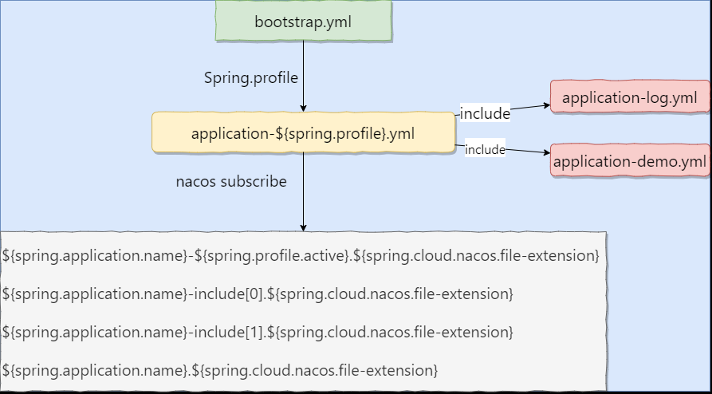
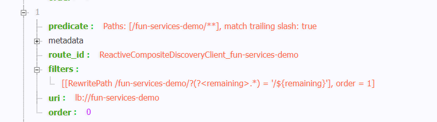
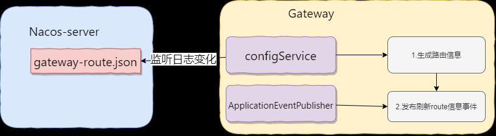

### 日志切换

springboot logback -> log4j2 

日志等级: 

```
- fatal（致命）
- error（错误）
- warn（警告）
- info (the default)（信息（默认值））
- debug（调试）
- trace（跟踪）

```


- reason:
  

- content: 
  
  *  排除springboot 自带的log, 添加log4j2
  
  ```xml
  <dependencies>
   <dependency>
            <groupId>org.springframework.boot</groupId>
            <artifactId>spring-boot-starter-web</artifactId>
            <!--             排除掉springboot 自带的log-->
            <exclusions>
                <exclusion>
                    <artifactId>spring-boot-starter-logging</artifactId>
                    <groupId>org.springframework.boot</groupId>
                </exclusion>
                <exclusion>
                    <groupId>log4j</groupId>
                    <artifactId>*</artifactId>
                </exclusion>
                <exclusion>
                    <groupId>org.slf4j</groupId>
                    <artifactId>*</artifactId>
                </exclusion>
                <exclusion>
                    <groupId>org.apache.logging.log4j</groupId>
                    <artifactId>*</artifactId>
                </exclusion>
            </exclusions>
  
        </dependency>
        <!--         引入log4j2-->
        <!--         设置 log4j2日志-->
        <dependency>
            <groupId>org.springframework.boot</groupId>
            <artifactId>spring-boot-starter-log4j2</artifactId>
        </dependency>
  </dependencies>
  ```
  * 配置log4j2.xml文件 ,在 application.yml中添加配置信息	
  
    补充说明, 由于springboot 版本升级导致 spring.profile.active 报错问题的解决方案
    [参考链接](https://github.com/spring-projects/spring-boot/wiki/Spring-Boot-Config-Data-Migration-Guide)
```yaml
spring: # every serice needed
  config: # springboot_2.4 use different control logic in this.
    use-legacy-processing: true
```
​		题外话: 若application.yml存在中文, 可能会因为编码问题报错, 尽量使用 english注释.

* 日志文件的存放问题, 日志名称的命名问题?

  1.日志文件存放位置:  ./logs/文件夹下

  2.每个微服务一份日志文件, 根据 微服务名 创建日志文件, ./logs/services-name.log

   解决方案:

​	 按照springboot 的启动顺序, 在 **application.yml 加载完成-> xxx.xml 未加载** 过程之间 实现对 xml文件内容填充即可. 

###  Controller层参数校验

> https://segmentfault.com/a/1190000023471742

1. `POST`、`PUT`请求，使用`requestBody`传递参数；
2. `GET`请求，使用`requestParam/PathVariable`传递参数。

Bean Validation 中内置的 constraint

| @Valid                      | 被注释的元素是一个对象，需要检查此对象的所有字段值       |
| --------------------------- | -------------------------------------------------------- |
| @Null                       | 被注释的元素必须为 null                                  |
| @NotNull                    | 被注释的元素必须不为 null                                |
| @AssertTrue                 | 被注释的元素必须为 true                                  |
| @AssertFalse                | 被注释的元素必须为 false                                 |
| @Min(value)                 | 被注释的元素必须是一个数字，其值必须大于等于指定的最小值 |
| @Max(value)                 | 被注释的元素必须是一个数字，其值必须小于等于指定的最大值 |
| @DecimalMin(value)          | 被注释的元素必须是一个数字，其值必须大于等于指定的最小值 |
| @DecimalMax(value)          | 被注释的元素必须是一个数字，其值必须小于等于指定的最大值 |
| @Size(max, min)             | 被注释的元素的大小必须在指定的范围内                     |
| @Digits (integer, fraction) | 被注释的元素必须是一个数字，其值必须在可接受的范围内     |
| @Past                       | 被注释的元素必须是一个过去的日期                         |
| @Future                     | 被注释的元素必须是一个将来的日期                         |
| @Pattern(value)             | 被注释的元素必须符合指定的正则表达式                     |

Hibernate Validator 附加的 constraint

| 注解                                          | 作用                                                         |
| --------------------------------------------- | ------------------------------------------------------------ |
| @Email                                        | 被注释的元素必须是电子邮箱地址                               |
| @Length(min=, max=)                           | 被注释的字符串的大小必须在指定的范围内                       |
| @NotEmpty                                     | 被注释的字符串的必须非空                                     |
| @Range(min=, max=)                            | 被注释的元素必须在合适的范围内                               |
| @NotBlank                                     | 被注释的字符串的必须非空                                     |
| @URL(protocol=,host=, port=, regexp=, flags=) | 被注释的字符串必须是一个有效的url                            |
| @CreditCardNumber                             | 被注释的字符串必须通过Luhn校验算法，银行卡，信用卡等号码一般都用Luhn计算合法性 |
| @ScriptAssert(lang=, script=, alias=)         | 要有Java Scripting API 即JSR 223(“Scripting for the JavaTM Platform”)的实现 |
| @SafeHtml(whitelistType=,additionalTags=)     | classpath中要有jsoup包                                       |

####  RequestBody 参数校验

触发条件:

* DTO(**Data Transfer Object**) 对象 声明约束条件

```java
@Data
@Accessors(chain = true)
public class Student {
    @NotNull(message = "name 不能为空")
    @Length(min = 2, max = 10)
    String name;
    @NotNull(message = "age 不能为空")
    @Min(1) @Max(90)
    Integer age;
    @NotNull(message = "email 不能为空 ")
    @Email(message = "email 格式不正确")
    String email;


}
```

* **Post , put** 请求,只需要在方法 的 请求头添加 @ReqeustBody  @Valid , @Validated

```java
  @PostMapping("/test/add/")
    public R testValidate(@RequestBody@Validated Student student) {
        System.out.println(student);
        return RUtils.createSucc(student);
    }
```

* 报错 :**MethodArgumentNotValidException** extends BindException

####  requestParam/PathVariable参数校验

处理get请求

触发条件: 

* Controller 类上 添加 @validated 注解

* Controller 中method 添加 约束条件

  ```java
  @RestController
  @Validated
  public class DemoController{
         /**
       * 测试 get reqeust 请求, 参数校验
       * @param account
       * @return
       */
      @GetMapping("/test/get")
      public R testGetReqVal(@Length(min = 6,max=20)@NotNull String account){
          return RUtils.createSucc(account);
      }
  }
  ```

* 处理 ConstraintViolationException.class 异常 


#### 分组校验

user{

​	uid; // 创建user对象不一定要有, update user 时一定要有

​	name; // 创建时要有, update 可以有

​	age;// 创建时可以没有, update 可以有,也可以没有

​	//......

} 

可以根据不同的情况创建 实现不同的校验规则.

**用途: 可以用于校验多个数据** 

#### 自定义校验

* 目的: 实现统一类中多个属性 交叉校验 

* example : 校验学生信息 年龄与生日是否相匹配

*  Spring 方案:

  *  为每一个需要多属性校验的类(Student)添加一个自定义注解(此例中是@BirthAndAgeValid), 以及此校验的校验规则 (此例中为BirthAndAgeValidator)

  		* 每一次开发需要的类数量为2 
			
  		* 缺点: 随着需要此类校验类的数量增多,  **注解@XXXValid**, 以及校验规则**XXXValidator** 也同时增加,后期维护成本高. 

* 基于Spring的扩展方案:
  *  在Spring原来的基础上,开辟一个接口,让此接口处理需要 **自定义校验** 需求. 

* 学生信息 Student

  ```java
  package com.fun.demo.entity;
  
  
  import com.baomidou.mybatisplus.annotation.TableId;
  import com.fun.common.core.domain.BaseEntity;
  import io.swagger.annotations.ApiModel;
  import io.swagger.annotations.ApiModelProperty;
  import lombok.Data;
  import lombok.EqualsAndHashCode;
  
  /**
   * 学生表(Student)表实体类
   *
   * @author whywhathow
   * @since 2022-02-21 22:52:16
   */
  @EqualsAndHashCode(callSuper = true)
  @Data
  @ApiModel(description = "Student实体类")
  @SuppressWarnings("serial")
  public class Student extends BaseEntity {
  
      /**
       * 学生id
       */
      @TableId
      @ApiModelProperty("学生id")
      private Long sid;
      /**
       * 学生姓名
       */
      @ApiModelProperty("学生姓名")
      private String name;
      /**
       * 性别
       */
      @ApiModelProperty("性别")
      private Integer gender;
      /**
       * 邮箱
       */
      @ApiModelProperty("邮箱")
      private String email;
  }
  
  ```

* 

##### Spring 原始方案:

*  注解类:BirthAndAgeValid

```java
package com.fun.demo.valid.annotation;

import com.fun.demo.valid.validator.BirthAndAgeValidator;

import javax.validation.Constraint;
import javax.validation.Payload;
import java.lang.annotation.*;

@Target(ElementType.TYPE)
@Retention(RetentionPolicy.RUNTIME)
@Documented
@Constraint(validatedBy = BirthAndAgeValidator.class)
public @interface BirthAndAgeValid {

    String message() default "生日与年龄不匹配";

    /**
     * 分组信息
     */
    Class<?>[] groups() default {};

    // 负载
    Class<? extends Payload>[] payload() default {};

}

```

* 校验类  BirthAndAgeValidator

```java
package com.fun.demo.valid.validator;

import com.fun.demo.domain.Student;
import com.fun.demo.valid.annotation.BirthAndAgeValid;
import lombok.extern.slf4j.Slf4j;

import javax.validation.ConstraintValidator;
import javax.validation.ConstraintValidatorContext;
import java.util.Calendar;
import java.util.Date;

/**
 * @program: fun-project
 * @description: 生日和年龄的校验规则
 * ConstraintValidator<EncryptId, String> , 第一个字段: 注解类型, 第二个字段: 注解修饰的字段
 * @author: WhyWhatHow
 * @create: 2022-02-19 16:26
 **/
@Slf4j
public class BirthAndAgeValidator implements ConstraintValidator<BirthAndAgeValid, Student> {
    private BirthAndAgeValid valid;

    @Override
    public void initialize(BirthAndAgeValid valid) {
        this.valid = valid;
    }

    @Override
    public boolean isValid(Student value, ConstraintValidatorContext context) {
        // birthday And Age 匹配校验
        if (value != null) {
            Date birthday = value.getBirthday();
            Integer age = value.getAge();
            Calendar cal = Calendar.getInstance();
            cal.setTime(birthday);
            int birthYear = cal.get(Calendar.YEAR);
            cal.setTime(new Date());
            int nowYear = cal.get(Calendar.YEAR);
            if (nowYear - birthYear == age) {
                return true;
            }
            return false;
        }
        // @NotNull 校验
        return true;
    }
}
```


##### Spring 扩展接口方案:

Spring的传统方案中, 存在后期**注解@XXXValid** ,规则校验器**XXXValidator** 类文件过多,维护复杂问题, 所以给出一个优化方案. 

* @FunValid

```java
package com.fun.common.web.valid.annotation;

import com.fun.common.web.valid.FunValidConstraint;
import com.fun.common.web.valid.handler.FunValidHandler;

import javax.validation.Constraint;
import javax.validation.Payload;
import javax.validation.constraints.NotNull;
import java.lang.annotation.ElementType;
import java.lang.annotation.Retention;
import java.lang.annotation.RetentionPolicy;
import java.lang.annotation.Target;

/**
 * 自定义数据校验注解, 可以用在 class, method
 *
 * @author whywhathow
 */
@Target({ElementType.TYPE, ElementType.METHOD, ElementType.FIELD, ElementType.PARAMETER})
@Retention(RetentionPolicy.RUNTIME)
@Constraint(validatedBy = {FunValidConstraint.class}) // 数据校验的实体类
public @interface FunValid {
    @NotNull
    String message() default "参数校验失败";

    /**
     * 分组校验
     */
    Class<?>[] groups() default {};

    /**
     * 负载
     */
    Class<? extends Payload>[] payload() default {};

    /**
     * FunValid 的 validator 数据校验类,
     * Eg: @FunValid(handler = XXXHandler.class), 就会按照XXXHandler定义的规则进行参数校验
     * Ps: 如果想要进行多数据间校验, 将@FunValid注解放于类中.
     */
    Class<? extends FunValidHandler> handler() ;
}

```

* FunValidHandler

  ```java
  package com.fun.common.web.valid.handler;
  
  import com.fun.common.web.valid.annotation.FunValid;
  
  public interface FunValidHandler<T> {
      /**
       * 基于spring validation 的二次开发, 实现参数校验,
       * 类,method, parameter 参数校验的核心逻辑.
       * Ps: 你只需要实现此方法,就可以实现 自定义参数校验
       * 与SpringValidation 对比: 省略了自定义注解的过程.
       *
       * @param value
       * @param funValid
       * @return
       */
      boolean valid(T value, FunValid funValid);
  
  }
  
  ```

* FunValidConstraint

  ```java
  package com.fun.common.web.valid;
  
  import com.fun.common.web.utils.ApplicationContextUtils;
  import com.fun.common.web.valid.annotation.FunValid;
  import com.fun.common.web.valid.handler.FunValidHandler;
  
  import javax.validation.ConstraintValidator;
  import javax.validation.ConstraintValidatorContext;
  import java.util.Optional;
  
  /**
   * @program: fun-project
   * @description: FunValid 的约束条件
   * @author: WhyWhatHow
   * @create: 2022-02-19 21:22
   **/
  public class FunValidConstraint implements ConstraintValidator<FunValid, Object> {
      private FunValid funValid;
  
      @Override
      public void initialize(FunValid valid) {
          this.funValid = valid;
      }
  
      @Override
      public boolean isValid(Object value, ConstraintValidatorContext context) {
          // 1. 校验逻辑
          if (value != null) {
              FunValidHandler handler = ApplicationContextUtils.getBean(funValid.handler());
              return  Optional.ofNullable(handler).
                      map(obj->{
                        return  handler.valid(value,funValid);
                      }).
                      orElse( false);
  
          }
          //2.交给@NotNull处理
          return true;
      }
  }
  
  ```

  * BirthdayAndAgeValidHandler

  ```java
  package com.fun.demo.valid.handler;
  
  import com.fun.common.web.valid.annotation.FunValid;
  import com.fun.common.web.valid.handler.FunValidHandler;
  import com.fun.demo.domain.Student;
  import org.springframework.stereotype.Component;
  
  import java.util.Calendar;
  import java.util.Date;
  
  /**
   * @program: fun-project
   * @description: 年龄生日校验器
   * @author: WhyWhatHow
   * @create: 2022-02-19 22:57
   **/
  @Component
  public class BirthdayAndAgeValidHandler implements FunValidHandler<Student> {
  
      @Override
      public boolean valid(Student stu, FunValid funValid) {
          Integer age = stu.getAge();
          Date birthday = stu.getBirthday();
          Date now = new Date();
          Calendar calendar = Calendar.getInstance();
          calendar.setTime(now);
          int nowYear = calendar.get(Calendar.YEAR);
          calendar.setTime(birthday);
          int birhYear = calendar.get(Calendar.YEAR);
          if (age == nowYear - birhYear) {
              return true;
          }
          return false;
      }
  }
  

### Spring 线程池优化

* 如何开启 Spring线程池? 

​	启动类 添加 @EnableAsync, 需要异步的方法中添加@Async

#### Spring 线程池优化方案

核心线程数= 你电脑的核心 线程数

最大线程数 = 核心线程数 * 2

<!-- 

todo :  阻塞队列 容量:   数据查找

-->

缺点:不能修改拒绝策略 :  rejection-policy:  abort ,默认抛异常

```yaml
spring:
  task:
    execution:
      pool: # settings for core-thread timeout. true == core-thread can gc
        allow-core-thread-timeout: false
        core-size: 4 # core-threads num 
        max-size: 8 # max-threads num
        queue-capacity: 1000
      thread-name-prefix: "Fun-Executor-"
    scheduling:
      pool:
        size: 2  #定时任务线程池大小,默认为1 
```


#### Spring 自定义线程池方案

思路: 利用autoconfiguration 实现自动注入.

* AsyncAutoConfiguration -- Spring自定义线程池实现

```java
package com.fun.common.web.async;

import com.fun.common.web.async.config.AsyncExecutionProperties;
import lombok.extern.slf4j.Slf4j;
import org.springframework.boot.autoconfigure.condition.ConditionalOnBean;
import org.springframework.boot.autoconfigure.task.TaskExecutionAutoConfiguration;
import org.springframework.boot.context.properties.EnableConfigurationProperties;
import org.springframework.context.annotation.Bean;
import org.springframework.context.annotation.Configuration;
import org.springframework.context.annotation.Primary;
import org.springframework.scheduling.annotation.EnableAsync;
import org.springframework.scheduling.concurrent.ThreadPoolTaskExecutor;

/**
 * @program: fun-project
 * @description: 自定义线程池配置类
 * @author: WhyWhatHow
 * @create: 2022-02-22 15:22
 * @see TaskExecutionAutoConfiguration
 **/
@Configuration
@Slf4j
@EnableConfigurationProperties(AsyncExecutionProperties.class)
public class AsyncAutoConfiguration {
    /***
     *  todo 思考是否其他的executor配置需要自定义,是否需要开放到yaml文档中,还是自己给默认值
     *  自定义线程池实现 ,只有在开启@EnableAsync 时创建
     * @param properties 线程池的自定义配置
     * @return 线程池executor
     */
    @Bean
    @Primary
    @ConditionalOnBean(annotation = EnableAsync.class)
    public ThreadPoolTaskExecutor getThreadPoolTaskExecutor(AsyncExecutionProperties properties) {
        log.warn(" [fun-task-executor] init");
        ThreadPoolTaskExecutor executor = new ThreadPoolTaskExecutor();

//  coreThreadSize, maxThreadSize, KeepAliveTime ,Queue, Timeunit,rejectHandler, Factory
        executor.setCorePoolSize(properties.getCoreSize()); // 核心线程数
        executor.setMaxPoolSize(properties.getMaxSize()); // 最大线程数
        executor.setKeepAliveSeconds(properties.getKeepAlive()); // 最大存活时间
        executor.setQueueCapacity(properties.getQueueCapacity()); // 阻塞队列容量
        executor.setThreadNamePrefix(properties.getThreadNamePrefix()); // 设置名称前缀
        executor.setRejectedExecutionHandler(properties.getRejectedHandler().getHandler());// 设置拒绝策略
        executor.setAllowCoreThreadTimeOut(properties.isAllowCoreThreadTimeout());// 是否允许核心线程超时
        executor.setPrestartAllCoreThreads(properties.isPrestartAllCoreThreads());// 是否启动所有核心线程,使其空闲等待工作
        executor.initialize();
        log.warn(" [fun-task-executor] end ");

        return executor;
    }
}

```

* AsyncExecutionProperties -- yaml 文件对应的配置类

  ```java
  package com.fun.common.web.async.config;
  
  import lombok.Data;
  import org.springframework.boot.autoconfigure.task.TaskExecutionProperties;
  import org.springframework.boot.context.properties.ConfigurationProperties;
  
  import javax.annotation.PostConstruct;
  import java.util.concurrent.RejectedExecutionHandler;
  import java.util.concurrent.ThreadPoolExecutor;
  
  /**
   * @program: fun-project
   * @description: 自定义线程池配置类, yaml配置
   * @author: WhyWhatHow
   * @create: 2022-02-22 15:46
   * @see TaskExecutionProperties
   **/
  @ConfigurationProperties("fun.async.task")
  @Data
  public class AsyncExecutionProperties {
      /**
       * 核心线程数
       */
      int coreSize;
      /**
       * 最大线程数
       */
      int maxSize;
      /**
       * 线程名前缀 eg: "task-"
       */
      private String threadNamePrefix = "task-";
  
      /**
       * queue capacity
       */
      private int queueCapacity = 1000;
  
      /**
       * 线程最大存活时间,单位s
       */
      private int keepAlive = 60;
  
      /**
       * 是否允许核心线程超时
       */
      private boolean allowCoreThreadTimeout = false;
  
      /**
       * 拒绝策略
       */
      private RejectedEnum rejectedHandler = RejectedEnum.CALLRUNSPOLICY;
      /**
       * 是否启动所有核心线程,使其空闲等待工作 ,默认为false
       */
      private boolean prestartAllCoreThreads = false;
  
  
      /**
       * 初始化 核心线程数, 最大线程数, 以用户配置为主
       */
      @PostConstruct
      void init() {
          if (coreSize <= 0) {
              this.coreSize = Runtime.getRuntime().availableProcessors();
          }
          if (maxSize <= 0) {
              this.maxSize = coreSize << 1;
          }
      }
  
      /**
       * 拒绝策略枚举
       */
      public enum RejectedEnum {
          ABORTPOLICY(new ThreadPoolExecutor.AbortPolicy()),
          CALLRUNSPOLICY(new ThreadPoolExecutor.CallerRunsPolicy()),
          DISCARDPOLICY(new ThreadPoolExecutor.DiscardPolicy()),
          DISCARDOLDESTPOLICY(new ThreadPoolExecutor.DiscardOldestPolicy());
          private RejectedExecutionHandler handler;
  
          RejectedEnum(RejectedExecutionHandler handler) {
              this.handler = handler;
          }
  
  
          public RejectedExecutionHandler getHandler() {
              return handler;
          }
  
          public void setHandler(RejectedExecutionHandler handler) {
              this.handler = handler;
          }
      }
  }
  
  ```

  

### API多版本切换

* 需求:

  *  应用升级后, 需要区分网页端,以及手机app 访问的不同的api, 比如有些手机用户需要访问api_1.0, 网页端用户需要访问api_2.0.
  * 后端系统升级后,可能会删除远古版本的api,如何保证这部分用户请求合理到后端系统.  

* 解决思路: 

  * 创建一个annotation @ApiVersion, 可以用于方法以及类中, 将controller 中每一个方法 赋予一个默认的版本号,不设置采用controller 的版本号,controller也未设置的话采用默认版本1.0. 
  * springmvc 拦截器拦截reqeust 请求,将会从http header 以及 http parameter 中获取api-version,找不到的话,会默认api-version为1.0 

* 源码实现分析:

  * 想要实现同一个类中 /test 请求多个method method, 思路就是 在controller 层添加唯一标记, 保证/test请求的唯一性.

  * 调用栈信息: 

    * DispatcherServlet.doDispatch() 

      *  mappedHandler = getHandler(processedRequest);

        ```java
        HandlerExecutionChain handler = mapping.getHandler(request);
        ```

#### 自定义enableXXX组件标准:

```java
package com.fun.common.web.apiversion.annotation;

import com.fun.common.web.apiversion.config.ApiVersionRegistrations;
import org.springframework.context.annotation.Import;

import java.lang.annotation.*;

/**
 * api 多版本管理的启动标签 , 一定要开启哦
 *
 * @see org.springframework.scheduling.annotation.EnableAsync
 */
@Target({ElementType.TYPE})
@Retention(RetentionPolicy.RUNTIME)
@Documented
@Import(ApiVersionRegistrations.class)//导入配置类-> 将ApiVersionHandlerMapping注册到spring 容器中. 
public @interface EnableApiVersion {

}
```


### swagger添加


### nacos 引入

HINT:

*  bootstrap.yml ,与 application.yml 配置文件 不要有内容的重复.重复的话, controller映射关系都会发生未知错误

### fun-porject配置文件读取顺序问题

读取顺序: 

 * bootstrap.yml :  配置 端口, 服务名,nacos地址, log日志

 * 根据 Spring.Profile.active 激活对应 application-${spring.profile.active}.yml 配置文件

    PS: 本文件可以 用 spring.profile.include: 标签-> 用来扩充 yaml配置文件

 * nacos 订阅的配置文件 , 默认格式为

   ```
   
   ${spring.application.name}-${spring.profile.active}.${spring.cloud.nacos.file-extension}
   
   ${spring.application.name}-include[0].${spring.cloud.nacos.file-extension}
   
   ${spring.application.name}-include[1].${spring.cloud.nacos.file-extension}
   
   ${spring.application.name}.${spring.cloud.nacos.file-extension}
   
   ```
   
   

### Spring Gateway 引入

Spring Gateway: -> webflux-> netty 

* 路由转发
* 熔断限流
* 日志记录
* 安全认证

**实现用户的验证登录，解决跨域，日志拦截，权限控制，限流，熔断，负载均衡，黑名单和白名单机制等。是微服务架构不二的选择**；

#### SpringGateway+Nacos实现静态路由,负载均衡:

[参考链接](https://blog.csdn.net/qq_24598601/article/details/121184691?utm_medium=distribute.pc_relevant.none-task-blog-2~default~baidujs_title~default-1.pc_relevant_default&spm=1001.2101.3001.4242.2&utm_relevant_index=4)

[官方文档

[](https://docs.spring.io/spring-cloud-gateway/docs/current/reference/html/#reactive-loadbalancer-client-filter)

fun-gatway中bootstrap.yml 主要配置如下:


 ```yaml
 # 定义nacos_ip
 NACOS_IP: @nacos.ip@
 server:
   port: 9000
 spring:
   application:
     name: fun-gateway
   profiles:
     active: @profile.active@
   cloud:
     nacos: #   配置nacos 地址
       discovery:
         server-addr: ${NACOS_IP}:${NACOS_PORT:8848}
     gateway:
       discovery:
         locator:
           lower-case-service-id: true #服务小写名称匹配
           enabled: true  # 开启注册中心
           url-expression: "uri"
       routes:
         - id: test-baidu
           uri: https://baidu.com
           predicates:
             - Path=/bd # https://www.baidu.com/bd
         - id: fun-services-demo # route ID ,唯一标记, 建议与spring.application.name 匹配
 #          uri: lb://fun-services-demo # 路由地址, lb:表示负载均衡
           uri: lb://fun-services-demo
           predicates:
             - Path=/**
 
 ```

1. 将 fun-gateway 服务注册到 nacos 中

   1.  简单 , 导入 spring-cloud-nacos-discovery 包就好

2. 配置route 路由规则, 配置**负载均衡 即 uri:lb://fun-services-demo(有坑, 有大坑)**

- ​	result: lb: 不成功,fun-gateway 不能成功路由到 具体的微服务中. 报 503 错误.  

- ​	**reason:** spring-cloud-starter-gateway 这个包没有 loadbalancer 这个包需要自己导入.

  ​		核心类: GatewayReactiveLoadBalancerClientAutoConfiguration 

  

####    Spring Gateway与 Nacos 实现 动态路由

动态路由: 即将gateway 的配置文件 交给 nacos 管理, 使用nacos更新 gateway 配置文件, 实现 gateway 路由的动态配置.

**主要方法: 可观测-> spring-boot-starter-actuator {包一定要引对}**

bootstrap.yml配置内容如下:

```yaml
management:
  endpoints:
    web:
      exposure:
        include: "gateway"
```

请求: http://localhost:9000/actuator/gateway/routes/


核心思路:

	1. nacos 管理 配置gateway route 配置文件-> gateway-route.json.
	1. gateway 加载路由信息 -> 动态监听 

>  Spring Cloud Gateway 中加载路由信息分别由以下几个类负责	
>
> 1、PropertiesRouteDefinitionLocator：从配置文件中读取路由信息(如YML、Properties等)
> 2、**RouteDefinitionRepository：从存储器中读取路由信息(如内存、配置中心、Redis、MySQL等)**
> 3、DiscoveryClientRouteDefinitionLocator：从注册中心中读取路由信息(如Nacos、Eurka、Zookeeper等)

step: 

* nacos 管理 路由配置信息(gateway-routes.json)并更新,

Hint: 

​	[不会就看官方文档](https://docs.spring.io/spring-cloud-gateway/docs/current/reference/html/#gateway-request-predicates-factories), 	[或者这篇文档](https://jishuin.proginn.com/p/763bfbd73353)

```json
[
    {
     "filters": [],
    "id": "baidu",
    "order": 2,
    "predicates": [{
        "args": {
            "pattern": "/bd/**"
        },
        "name": "Path"
    }],
    "uri": "https://baidu.com"
},
]
```

PS: gateway 连上nacos 后,会给每一个微服务注册一个路由地址 即

​	 **http://{spring.application.name}/{controller}/{method}**



* gateway 接收配置信息 , 转化成路由信息,并发布更新

  * 生成路由信息 **json-> routeDefinition**
  * 发布路由信息  **ApplicationEventPublisher.publishEvent(new RefreshRoutesEvent())**
  * gateway 更新路由信息
* 通过 actuator/gateway/routes 查询, 判断是否生效



#### Spring Gateway 限流


### oauth2认证与授权


### 消息通知


#### 架构模式:

 

 

- [ ] email: 

- [ ] 微信公众号: 


### mysql 线程池优化 druid

**参考 fun-config/src/resources-default/application-druid.yml 文件**

### Q&A

@configuration ,@Bean ,@Repository, @Component,@Service 之间的区别

* 都是用来在spring容器中进行组件注册的. 

@MapperScan : 配置默认扫描的包扫描,不需要在添加 @Mapper注解.

* MapperScannerRegistrar.class 生成BeanDefinition

Nacos 报 **no datasource set** error?

* mysql配置连接出错, ip 地址 应该是内网地址,不该是localhost
* mysql没有初始化 nacos-mysql.sql 表 

