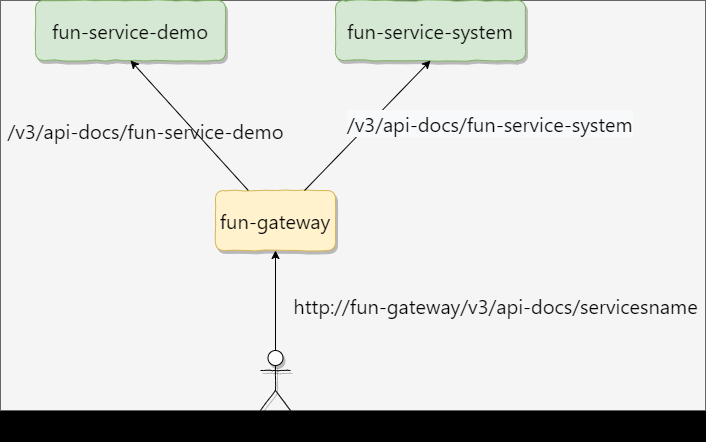

## SpringDoc 动态分组api引入

* 思路: 根据动态路由的思路, 思考到, 只要监听到`RouteRefreshEvent` 事件, 就可以实现动态API生成.
  1. user -> update gateway-route.json 文档, -> routeDefinition 数量发生变化
  2. `SpringDocRouteRefreshListener` 监听`RouteRefreshevent` ,监听到routes数量变化, 重新生成swagger.


## content:

### Springdoc 与swagger 不同处

- `@Api` → `@Tag`
- `@ApiIgnore` → `@Parameter(hidden = true)` or `@Operation(hidden = true)` or `@Hidden`
- `@ApiImplicitParam` → `@Parameter`
- `@ApiImplicitParams` → `@Parameters`
- `@ApiModel` → `@Schema`
- `@ApiModelProperty(hidden = true)` → `@Schema(accessMode = READ_ONLY)`
- `@ApiModelProperty` → `@Schema`
- `@ApiOperation(value = "foo", notes = "bar")` → `@Operation(summary = "foo", description = "bar")`
- `@ApiParam` → `@Parameter`
- `@ApiResponse(code = 404, message = "foo")` → `@ApiResponse(responseCode = "404", description = "foo")`

### springdoc接入spring cloud gateway

> * 官方[demo](http://158.101.191.70:8060/webjars/swagger-ui/index.html)
>
> * [官方文档](https://springdoc.org/#springdoc-applications-demos)

#### 微服务模块

* 添加依赖 eg:  fun-service-demo, fun-service-system

```xml
   <dependency>
            <groupId>org.springdoc</groupId>
            <artifactId>springdoc-openapi-webmvc-core</artifactId>	
   </dependency>
```

#### 网关模块

fun-gateway 

思路: swagger-ui 由 网关模块统一生成

1. 用户请求 http://fun-gateway/swagger-ui.html 页面
2. 用户选择对应的微服务模块 跳转 以 fun-service-demo 为例, 即 http://fun-gateway/v3/api-docs/fun-service-demo
3. 网关模块 根据 服务名进行路由转发. 此例即转发到fun-service-demo中,获取 api-docs信息
4. 网关模块更加api-docs模块信息生成swagger-ui




* #### fun-gateway: 添加依赖

```xml
<!--       springdoc-open-api -->
<dependency>
    <groupId>org.springdoc</groupId>
    <artifactId>springdoc-openapi-webflux-ui</artifactId>
</dependency>
```

* #### fun-gateway: openapi路由配置以及网关跨域配置

  - application.yml

```yaml
spring:
  cloud:
    gateway:  #            Gateway 网关默认配置
      globalcors: # gateway 跨域问题
        cors-configurations:
          '[/**]':
            allowedOrigins: "*"
            allowedMethods:
              - GET
              - POST
              - PUT
              - DELETE
              - OPTIONS
      discovery:
        locator:
          lower-case-service-id: true #服务小写名称匹配
          enabled: true  # 开启注册中心
      routes:
        - id: openapi  #  SpringDoc  route配置-> 动态api
          order: -1
          uri: http://fun-gateway:${server.port}
          predicates:
            - Path=/v3/api-docs/**
          filters:
            - RewritePath=/v3/api-docs/(?<path>.*),/$\{path}/v3/api-docs/

```

```
由配置可知,
http://fun-gateway/v3/api-docs/servicesname会转发到http://fun-gateway/{servicesname}/v3/api-docs/中
```

* #### 添加监听器,监听 `RefreshRoutesEvent`  

> 详情参考 `SpringDocRouteRefreshListener`

```java
    @Override
    public void onApplicationEvent(RefreshRoutesEvent event) {

        // 1. 获取刷新的routes 信息
        List<RouteDefinition> routeDefinitions = registry.getList();
        int size = routeDefinitions.size();
        if (size == lastListSize) {
            return;
        }
        // 统计 更新时间,以及次数
        log.warn("[Fun-RefreshRoutesEvent] --- start ,count: {}", count.incrementAndGet());

        lastListSize = size;
        // 2. 清空 swagger urls  重新构建
        swaggerUiConfigParameters.getUrls().clear();
        routeDefinitions.forEach(routeDefinition -> {
                    String name = routeDefinition.getId();
                    //   3 重新构建api
                    if (name.startsWith(FUN_SERVICE_PREFIX)) {
                        name = removeServicePrefix(routeDefinition, name);
                        swaggerUiConfigParameters.addGroup(name);
                        // /demo, /api/demo/v3/api-docs
//                GroupedOpenApi build = GroupedOpenApi.builder().pathsToMatch("/" + name + "/**").group(name).build();
                    }
                }
        );
    }

```

* #### 通过nacos 修改gateway-route.json 配置路由规则.

```json
[
{
    // fun-services-demo -> 配合前端使用
    "id": "fun-service-demo",
    "order": 1,
    "predicates": [{
        "args": {
            "pattern": "/api/demo/**"
        },
        "name": "Path"
    }],
    "filters": [{
        "args":{
            "parts": 2
        },
        "name":"StripPrefix"
    }],
    "uri": "lb://fun-service-demo"
},
{
    // springdoc 配置, swagger应用
    "id": "fun-service-demo-api",
    "order": 1,
    "predicates": [{
        "args": {
            "pattern": "/demo/**"
        },
        "name": "Path"
    }],
    "filters": [{
        "args":{
            "parts": 1
        },
        "name":"StripPrefix"
    }],
    "uri": "lb://fun-service-demo"
},  
]
```

### Swagger调用其他微服务的跨域配置

思路:

1. 在prod 环境中, 所有的用户请求会走fun-gateway 网关模块, 即只需在网关模块配置 corsfilter 即可 -> application.yml 中, 并且不会使用spring-doc.
2. 在其他环境中, 用户可以访问http://fun-gateway/swagger-ui.html 调用其他微服务连接.所以需要解决在做这种模式中cors跨域问题.

解决方案: 

在非prod环境中, 配置corsfilter 即可实现

> `com.fun.common.web.config.CorsAutoConfiguration`

```java
@Profile("!prod")
@Configuration
public class CorsAutoConfiguration {
    private CorsConfiguration buildConfig() {
        CorsConfiguration corsConfiguration = new CorsConfiguration();
        corsConfiguration.addAllowedOrigin("*");
        corsConfiguration.addAllowedHeader("*");
        corsConfiguration.addAllowedMethod("*");
        corsConfiguration.setMaxAge(3600L);
//
//        corsConfiguration.setAllowCredentials(true);
        return corsConfiguration;
    }

    @Bean
    public CorsFilter corsFilter() {
        UrlBasedCorsConfigurationSource source = new UrlBasedCorsConfigurationSource();
        source.registerCorsConfiguration("/**", buildConfig());
        return new CorsFilter(source);
    }
}

```

 


## How to use?

simple, 你只需要添加 如下路由信息到 gateway-route.json中即可.

**Hint: 修改路由的时候,需要保证routes 数量发生变换, swagger 才会同步(reason: 避免因为心跳连接带来的频繁更新)**

```json
[
{
    // fun-services-demo -> 配合前端使用
    "id": "fun-service-demo",
    "order": 1,
    "predicates": [{
        "args": {
            "pattern": "/api/demo/**"
        },
        "name": "Path"
    }],
    "filters": [{
        "args":{
            "parts": 2
        },
        "name":"StripPrefix"
    }],
    "uri": "lb://fun-service-demo"
},
{
    // springdoc 配置, swagger应用
    "id": "fun-service-demo-api",
    "order": 1,
    "predicates": [{
        "args": {
            "pattern": "/demo/**"
        },
        "name": "Path"
    }],
    "filters": [{
        "args":{
            "parts": 1
        },
        "name":"StripPrefix"
    }],
    "uri": "lb://fun-service-demo"
},  
]
```


## Reference:

* [跨域问题](https://www.labradors.work/2022/03/21/SpringCloud%E7%BD%91%E5%85%B3Springdoc%E8%81%9A%E5%90%88API%E9%85%8D%E7%BD%AE/)
* 官方[demo]()